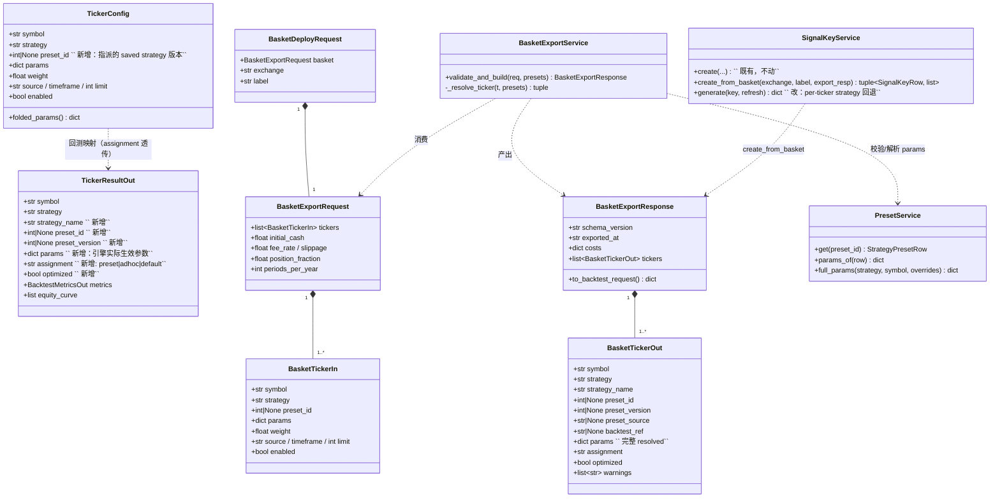
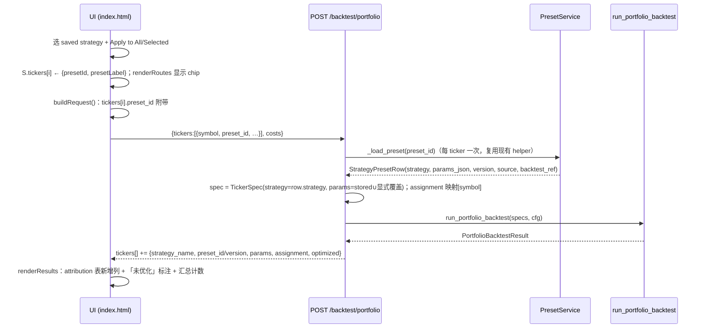
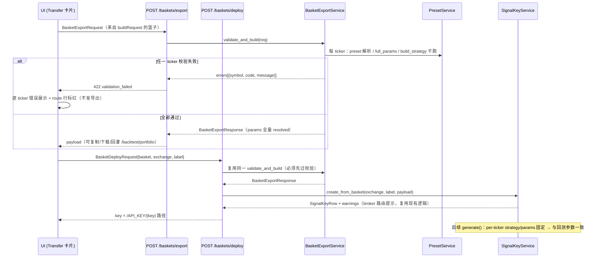
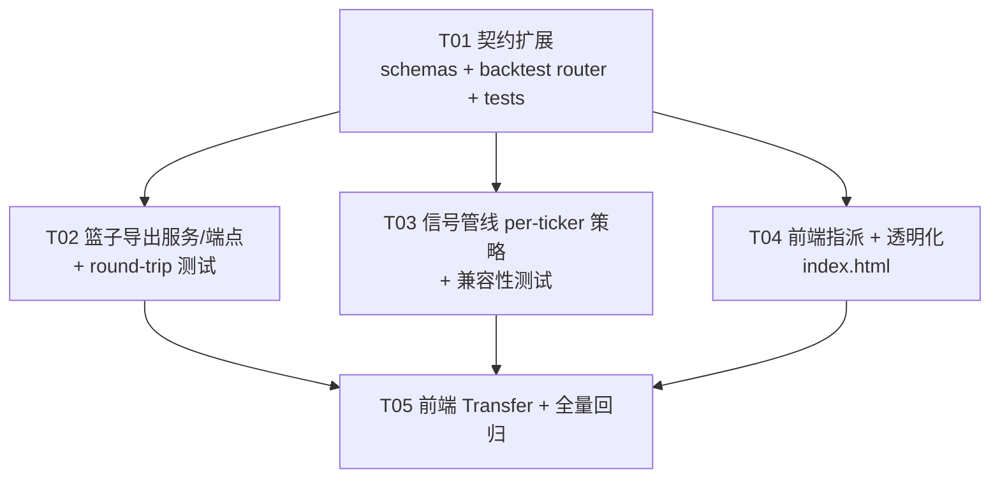

# 增量设计：篮子级策略指派 · 回测透明化 · 完整篮子转移

> 面向既有 GEX Trading Console（FastAPI 后端 + `trading/static/index.html` 单页前端）的增量设计。
> 原则：**手术式改动** —— 每处改动可追溯到三条需求之一；复用现有模型与 UI 模式；导出 payload 参数无损（round-trip）。

---

## 0. 现状调研结论（设计依据）

| 关注点 | 现状 | 结论 |
|---|---|---|
| **篮子（basket）存储** | 篮子只存在于前端状态 `S.tickers`（index.html `newTicker()`），**服务端无持久化** | 需求 1/2 主要是前端 + 请求/响应契约扩展；无需新表 |
| **每 ticker 独立策略** | `TickerConfig`（schemas.py）已支持 per-ticker `strategy`/`params`；`PortfolioBacktestRequest.tickers` 直通 `TickerSpec` | 需求 1 的"不同 ticker 不同策略"已存在，缺口是**与 saved strategies（preset）的绑定** |
| **Saved strategies 存储** | `strategy_presets` 表（`StrategyPresetRow`）+ `PresetService` 版本化存储；`GET /presets/latest` 返回每组最新版本 | 直接复用，不新增存储。preset 的 `params_json` 已是**完整 resolved 参数集**（`save_version(expand=True)` / `full_params()` 保证） |
| **单 ticker preset 绑定现状** | 前端 `bt-preset-apply` 仅按 symbol 匹配**单个** ticker，写 `t.presetId`；`BacktestRequest.preset_id` 已有服务端支持 | 扩展为篮子级（all/selected subset）指派 |
| **组合回测请求的 preset 支持** | `TickerConfig` **没有** `preset_id`（只有单 symbol `BacktestRequest` 有）→ 组合回测无法按 preset 原样运行 | **缺口 A**：`TickerConfig` 增加 `preset_id`，router 解析后填 `TickerSpec.strategy/params` |
| **回测结果透明度** | `TickerResultOut(symbol, strategy, source, timeframe, weight, capital, metrics, equity_curve, n_trades)` —— **无 params、无 preset 信息、无"未优化"标注** | **缺口 B**：响应扩展 assignment 字段 |
| **实时信号管线** | `SignalKeyRow.config_json` → `SignalKeyService.generate()` 重跑 portfolio backtest。config 里 tickers 为 `{symbol, params, preset_id}`，**strategy 是 key 级单一字段** | **缺口 C**：key 配置不支持 per-ticker strategy；需向后兼容扩展（老 config 缺省回退全局 strategy） |
| **对外 API 风格** | 全部挂 `/api/v1`，routers + Pydantic schemas（`trading/api/schemas.py`），写操作 `Depends(require_auth)`（Bearer token，`/auth/token`） | 新端点照此办理 |
| **Deploy 现有路径** | Deploy tab：optimize 全部 → `POST /signal-keys`（tickers 仅 symbol 列表，params 缺省跟随 preset store） | 保留不动；新增"篮子转移"独立入口 |
| **前端模式** | 卡片/eyebrow/`btn btn-ghost btn-sm`/表格 `data`/toast/`json(timeoutMs)`/`markStale()`/route 行 `chipHTML` | 新 UI 全部套用现有模式 |

三条需求的落点：

- **需求 1（篮子级指派）** = 前端指派 UI + `TickerConfig.preset_id`（缺口 A）。
- **需求 2（透明化）** = 响应契约扩展（缺口 B）+ 前端展示。
- **需求 3（完整转移）** = 新增 export/deploy 端点 + `SignalKeyService` per-ticker 扩展（缺口 C）+ 前端 Transfer 卡片。

---

## 1. 实现方案

### 1.1 需求 1：篮子级灵活策略指派

**后端（小改）**
- `TickerConfig` 增加 `preset_id: int | None = None`。
- `POST /backtest/portfolio`（及 `/portfolio/monte-carlo`、`/portfolio/report` 共用的 `_specs_from_request`）解析每个 ticker 的 `preset_id`：preset 的 `strategy` + `params_json` 作为基线，请求里显式给出的 params 仍按现有惯例逐键覆盖（与 `_load_preset` 同一约定）。preset 缺失 → HTTP 400（清晰指出 ticker 与 preset id）。
- 显式修改 strategy 时前端清除绑定（见下），因此不需要 `preset_id` 与 `strategy` 冲突仲裁逻辑。

**前端（index.html）**
- ticker 状态增加 `presetId`、`presetLabel`（`newTicker()` 默认 null）。
- 「Saved strategies」卡片增加指派控件：下拉选 saved strategy + **Apply to: All tickers / Selected only**（selected = 勾选了 `enabled` 的子集；实现上"选定子集"用每个 route 行已有的 ◉/○ enabled 开关，不引入新选择模式）。同一 saved strategy 一次应用到多个 ticker；不同 ticker 可先后应用不同 strategy。
- 每个 route 行的 Strategy 下拉旁显示**指派 chip**（复用 `fetch-chip` 样式：`preset 名 · vX`）+ ✕ 清除按钮；用户手动改 Strategy 下拉即清除该行的 presetId（一行逻辑挂在现有 `change` 处理器）。
- `buildRequest()` 对有 `presetId` 的 ticker 附带 `preset_id`（对齐 `singleRequest()` 现有行为）。

### 1.2 需求 2：回测页透明化

**后端（契约扩展）**
- `TickerResultOut` 增加：
  - `strategy_name: str = ""`（用户命名策略）
  - `preset_id: int | None = None`、`preset_version: int | None = None`
  - `params: dict = {}`（该 ticker 实际生效的完整 resolved 参数 —— 与引擎收到的一致，非用户输入回显）
  - `assignment: Literal["preset", "adhoc", "default"]`（preset 指派 / 显式 adhoc 参数 / 走策略默认，未优化）
  - `optimized: bool = False`（对应 preset 版本有 `optimizer_run_id` 或 `backtest_ref` 溯源；`assignment != "preset"` 恒为 False）
- `_portfolio_response()` 从 spec 构建期收集的 `symbol → assignment` 映射填充上述字段（不触碰 `run_portfolio_backtest` 内部，手术式）。
- 汇总视图与逐 ticker 明细共用同一份 `tickers[]` 数据，天然满足"两处都展示"。

**前端**
- Attribution 表（`attr-body`）增加「Strategy · version」列：显示 `strategy_label + (strategy_name vX)`；无指派时显示 `默认参数（未优化）` 灰色标注。
- 表格行下方展开（或 chip 提示）显示 params 摘要（关键参数键值，鼠标悬停完整 JSON，复用 `title` 属性 + 现有 `esc()`）。
- KPI 区下汇总行显示 `N tickers · M optimized · K 未指派`。

### 1.3 需求 3：完整篮子转移

新增一个应用服务 + 一个 router（2 个端点），**不新增数据库表**：

- **`POST /api/v1/baskets/export`**（require_auth）：接收完整篮子，服务端**导出前校验**并返回参数无损 payload。
- **`POST /api/v1/baskets/deploy`**（require_auth）：同样校验后直接创建 signal key（把篮子注入实时信号管线），返回 key + warnings。

**校验规则（422，`detail={"code":"validation_failed","errors":[{symbol, code, message}]}`）**
- ticker 缺策略（无 `preset_id` 且无 `strategy`）→ `strategy_missing`。
- ticker 无参数可用（无 preset、`params` 为空、且策略有必填参数）→ `params_missing`。
- preset id 不存在 → `preset_not_found`。
- `build_strategy(strategy, symbol, params)` 干跑失败 → `build_failed`。
- 逐 ticker 报错，一条错误不吞掉其它 ticker 的诊断。

**Round-trip 保证（参数无损）**
- payload 中每个 ticker 的 `params` = **服务端从 preset store 解析出的完整 resolved 参数集**（`PresetService.params_of` / `full_params`），而非前端回显；无 preset 的 ticker 用其显式 params 原样（缺失即校验失败，不存在"静默补默认"）。
- payload 顶层附带 costs/timeframe 等全局项；payload 的 `tickers[]` 与 `PortfolioBacktestRequest.tickers` 的 `TickerConfig` 字段一一对应（见 §4 schema），**payload 直接（或经字段映射后）POST 回 `/backtest/portfolio` 即可复现完全相同的参数**——映射表写入 §8 共享知识并有测试固化。
- payload 带 `schema_version` 与 `preset` 溯源（id/version/source/backtest_ref），仅作审计，不参与回灌。

**SignalKeyService 扩展（向后兼容）**
- 新方法 `create_from_basket(...)`：接收 deploy 请求，`config_json.tickers` 升级为 `{symbol, strategy, params, preset_id, source, timeframe, limit}`（`params` **固定写入** —— 满足"精确保留参数，实盘与回测一致"，不跟随后续 preset 升级；这是与现有 `create()` "跟随 store" 语义的有意差异）。
- `generate()` 的 spec 构建循环改为 per-ticker `strategy = t.get("strategy") or config["strategy"]`（老 config 无 per-ticker strategy → 回退，完全兼容）；`source/timeframe/limit` 同样允许 per-ticker 覆盖。
- 现有 `create()` / Deploy tab 流程**不动**。

**前端**
- Backtest tab 新增「Transfer basket」卡片（或 actionbar 按钮 + 卡片，套用 Deploy tab 卡片模式）：broker 选择（bingx/tbank，复用 `dp-broker` 的选项集）→
  - `Validate & preview payload`（调 `/baskets/export`）：成功 → 显示可复制/下载的 payload JSON（复用 `btn-copy-json` 模式）；失败 → 逐 ticker 错误列表（复用 `note err` 模式）。
  - `Deploy to live signals`（调 `/baskets/deploy`）：成功 → toast 显示 key 与 dashboard 路径（复用 `dpCreateKey` 的提示模式）。
- 校验失败的 ticker 在 route 行标红（`data-state="error"` 既有机制）。

---

## 2. 文件列表（改 / 新增）

| # | 路径 | 动作 | 说明 |
|---|---|---|---|
| 1 | `trading/api/schemas.py` | 改 | `TickerConfig.preset_id`；`TickerResultOut` 透明化字段；新增 `BasketTickerIn` / `BasketExportRequest` / `BasketTickerOut` / `BasketExportResponse` / `BasketDeployRequest` |
| 2 | `trading/api/routers/backtest.py` | 改 | `_specs_from_request` 解析 preset → spec + assignment 映射；`_portfolio_response` 填充透明化字段；共用 helper `_resolve_assignment()` |
| 3 | `trading/application/basket_export.py` | **新增** | 导出校验 + payload 组装（纯应用服务，可独立测试） |
| 4 | `trading/api/routers/baskets.py` | **新增** | `POST /baskets/export`、`POST /baskets/deploy`（require_auth） |
| 5 | `trading/main.py` | 改 | 注册 `baskets.router` |
| 6 | `trading/application/signal_keys.py` | 改 | 新增 `create_from_basket()`；`generate()` 支持 per-ticker `strategy/source/timeframe/limit`（向后兼容回退） |
| 7 | `trading/static/index.html` | 改 | 指派 UI（Saved strategies 卡片 + route 行 chip + buildRequest）、透明化展示（attribution 表 + 汇总）、Transfer 卡片 |
| 8 | `trading/tests/test_api_portfolio.py` | 改 | `preset_id` 指派回测 + 响应透明化字段断言 |
| 9 | `trading/tests/test_api_baskets.py` | **新增** | 导出校验（各失败码）/ payload round-trip / deploy 建 key / 老 key config 兼容 |
| 10 | `trading/tests/test_signal_keys.py`（如已有则追加；否则并入 test_api_baskets.py） | 改 | `generate()` per-ticker strategy 用例 |

不改：`application/backtest/portfolio.py`（`TickerSpec` 原样）、`presets.py`、`models.py`（**无 schema 迁移**）、Deploy tab 既有逻辑。

---

## 3. 数据结构与接口

### 3.1 类图（核心新增/扩展）



### 3.2 导出 payload JSON Schema（参数无损，round-trip）

```json
{
  "schema_version": "1",
  "exported_at": "2025-01-01T00:00:00Z",
  "costs": {
    "initial_cash": 100000.0,
    "fee_rate": 0.001,
    "slippage": 0.0005,
    "position_fraction": 0.95,
    "periods_per_year": 252
  },
  "tickers": [
    {
      "symbol": "NVDA",
      "strategy": "trend_confluence_unified",
      "strategy_name": "nvda-core",
      "preset_id": 42,
      "preset_version": 3,
      "preset_source": "optimizer",
      "backtest_ref": "optimizer:abc123",
      "params": { "…完整 resolved 参数集，来自 preset store…": 0 },
      "assignment": "preset",
      "optimized": true,
      "weight": 1.0,
      "source": "yfinance",
      "timeframe": "1d",
      "limit": 1500,
      "enabled": true,
      "warnings": []
    }
  ]
}
```

- `costs` ↔ `PortfolioBacktestRequest` 顶层同名字段直通；`tickers[]` 每项去掉溯源字段（`strategy_name/preset_*/backtest_ref/assignment/optimized/warnings`）后即合法 `TickerConfig`。
- **不合法回灌的 payload 不可能通过校验产出**：`params` 非空且 `build_strategy` 干跑通过是导出的前置条件。

### 3.3 错误响应（422）

```json
{ "detail": { "code": "validation_failed", "errors": [
    { "symbol": "SPY", "code": "params_missing",
      "message": "no saved strategy assigned and no explicit params provided" } ] } }
```

---

## 4. 关键调用流程

### 4.1 指派变更 → 回测 → 透明化展示



### 4.2 导出校验 → 外部 payload / 实时信号管线



---

## 5. 依赖包列表

**无新增第三方依赖。** 全部复用现有栈：FastAPI + Pydantic v2、SQLAlchemy(async)、既有前端零依赖单文件。

---

## 6. 任务列表（按依赖顺序）

| Task ID | 任务名 | 涉及文件 | 依赖 | 优先级 | 验收标准 |
|---|---|---|---|---|---|
| **T01** | 契约扩展：per-ticker preset 指派 + 回测透明化 | `trading/api/schemas.py`、`trading/api/routers/backtest.py`、`trading/tests/test_api_portfolio.py` | — | P0 | ① `TickerConfig` 接受 `preset_id`，组合回测按 preset 的 strategy+params 原样运行（显式 params 仍逐键覆盖）；② preset 不存在 → 400 且 message 含 ticker 与 id；③ `TickerResultOut` 返回 `strategy_name/preset_id/preset_version/params/assignment/optimized`；④ 无 preset 的 ticker `assignment="default"`、`optimized=false`；⑤ 全部 pytest 通过（venv：`./venv/Scripts/python.exe -m pytest trading/tests`） |
| **T02** | 篮子导出服务 + 端点（校验 & round-trip payload） | `trading/application/basket_export.py`（新）、`trading/api/routers/baskets.py`（新）、`trading/main.py`、`trading/tests/test_api_baskets.py`（新） | T01 | P0 | ① `POST /baskets/export` 对每个 ticker 完成 preset 解析 + `build_strategy` 干跑；② 缺策略/缺参数/preset 不存在/构建失败 → 422 且 errors 逐 ticker 带 code；③ 成功 payload 的 `tickers[]` 去掉溯源字段后可直接 POST `/backtest/portfolio` 并复现相同 params（测试固化 round-trip）；④ 两个端点均 `require_auth` |
| **T03** | 信号管线 per-ticker 策略支持（向后兼容） | `trading/application/signal_keys.py`、`trading/tests/test_signal_keys.py`（或并入 test_api_baskets.py） | T01 | P0 | ① `create_from_basket()` 写入 per-ticker `{strategy, params(固定), preset_id, source, timeframe, limit}`；② `generate()` 对新 config 按 ticker 的 strategy 构建 TickerSpec，对老 config（无 per-ticker strategy）回退全局 strategy（测试覆盖新旧两种 config）；③ 现有 `create()`/Deploy 流程行为不变 |
| **T04** | 前端：篮子级指派 + 回测透明化展示 | `trading/static/index.html` | T01 | P1 | ① Saved strategies 卡片支持一次性应用到全部/选定（enabled）子集，可为不同 ticker 应用不同 strategy；② route 行显示指派 chip（名 · vX）与清除按钮；手动改 Strategy 下拉清除绑定；③ buildRequest 携带 `preset_id`；④ attribution 表 + 汇总显示策略名/版本/params 摘要，未指派显式标注「未优化」；⑤ demo 模式不崩（mock 兜底） |
| **T05** | 前端：Transfer 卡片 + 全量回归 | `trading/static/index.html`、（回归）`trading/tests/` 全量 pytest | T02, T03, T04 | P1 | ① Transfer 卡片：Validate & preview（成功显示 payload JSON 可复制，失败逐 ticker 错误 + route 行标红）、Deploy to live signals（成功 toast key + dashboard 路径）；② `./venv/Scripts/python.exe -m pytest trading/tests` 全绿（基线 716 passed / 1 skipped + 新增用例） |

依赖关系说明：T02/T03/T04 仅依赖 T01（契约先行），彼此独立可并行；T05 是纯前端集成 + 回归收口。

---

## 7. 任务依赖图



---

## 8. 共享知识（跨文件约定）

1. **API 风格**：所有新端点挂 `/api/v1`（`main.py` 统一 prefix）；写操作 `dependencies=[Depends(require_auth)]`；schemas 全部集中在 `trading/api/schemas.py`，命名 `*In/*Out/*Request/*Response` 沿用现状。
2. **错误格式**：HTTPException detail 为字符串或 `{code, ...}` dict；校验失败统一 `422` + `{"code": "validation_failed", "errors": [{symbol, code, message}]}`（对齐 `PresetValidationError` 风格）。
3. **preset = 参数唯一真源**：preset 的 `params_json` 永远是完整 resolved 参数集；任何"完整参数"需求都走 `PresetService.params_of` / `full_params`，**禁止在前端或导出层自行补默认值**。
4. **round-trip 映射表（payload → 回灌）**：`costs.*` → `PortfolioBacktestRequest` 顶层同名字段；`tickers[].{symbol,strategy,params,weight,source,timeframe,limit,enabled}` → `TickerConfig` 同名字段；溯源字段（`strategy_name/preset_id/preset_version/preset_source/backtest_ref/assignment/optimized/warnings`）回灌时**忽略**。此映射由 T02 测试固化。
5. **兼容约定**：`SignalKeyRow.config_json` 中 tickers 项的 `strategy` 键可选 —— 缺省回退顶层 `strategy`（老数据零迁移）；`TickerConfig.preset_id` 缺省 None 行为与现在完全一致。
6. **前端约定**：单文件 index.html，状态挂 `S`；UI 复用 `card/card-head/section-body/field/btn/pill/fetch-chip/note/toast` 既有 class；所有插值过 `esc()`；API 调用走 `json()` 封装（长操作传 `timeoutMs`/`signal`）；改配置后 `markStale()`。
7. **测试约定**：pytest 用项目 venv（`./venv/Scripts/python.exe -m pytest trading/tests`）；API 测试走 httpx AsyncClient 直打 app；optimize 响应键为 `best/leaderboard/n_candidates`（既有约定，勿改名）。

---

## 9. 待明确事项（附推荐方案，不阻塞实现）

1. **"外部 API 端点"的具体含义**。推荐假设（已按此设计）：提供可复制/下载的标准 JSON payload，用户可 POST 到任意外部系统；同时 `/baskets/export` 本身就是本服务的对外 REST 端点。若用户意指"系统主动回调某个第三方 URL"，需补充目标端点与鉴权方式（将只加一个 `target_url` 的转发分支，不改变 payload schema）。
2. **导出的严格度**。推荐：缺 preset 但带完整显式 params 的 ticker **允许**导出（warnings 提示"非优化配置"）；只有"无 preset 且参数不足/构建失败"才 422。若用户要求"全部 ticker 必须来自优化过的 preset"，把 `optimized=false` 也纳入 422 即可（一行校验开关的位置已预留）。
3. **实盘 key 是否跟随 preset 后续升级**。推荐（已按此设计）：转移时 params **固定**写入 key config —— "精确保留参数，实盘与回测一致"是硬需求；现有 Deploy tab 的"跟随 store"语义保持不变，两者并存语义不同、用途不同。若用户希望转移的 key 也跟随 store，把 `create_from_basket` 的 params 置 None 即可复用现有解析链。
4. **篮子本身是否要持久化（"保存篮子"功能）**。推荐：本迭代不做（需求未要求，篮子仍为前端状态）；导出 payload 文件即事实上的篮子快照。若后续要"命名保存篮子"，再加一张表，不影响本设计。
5. **`assignment="adhoc"` 的 ticker 在 Deploy tab 老流程中的行为**。推荐：老流程只认 symbol 列表（现状），adhoc 参数只在新的 Transfer 流程生效；不做交叉兼容。
