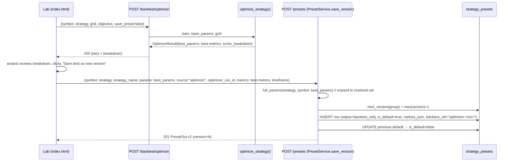
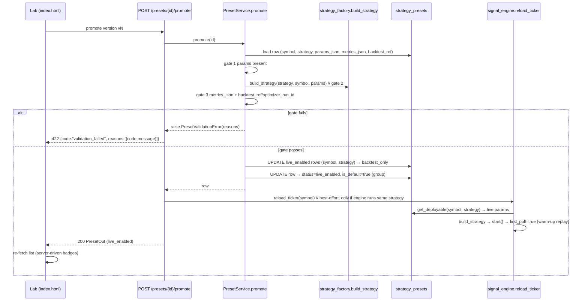
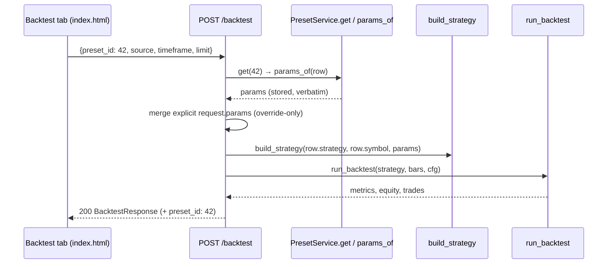

# System Design — Strategy Hub: Versioned Strategy Store for Lab, Backtest & Live API

**Status**: v1.0 · **Owner**: Architect (Bob/高见远) · **Input**: `docs/prd-strategy-hub.md` (approved)
**Repo**: `E:\gex api` · **Scope**: P0 features F1–F8 (+F9 demote, needed by Q1) · **New runtime deps**: none

---

## 1. Implementation Approach & Rationale

### 1.1 Why extend `strategy_presets` instead of a new table

`StrategyPresetRow` (`trading/adapters/persistence/models.py`) *already is* the per-ticker
strategy store: `PresetService` + `PresetRepository` already implement save/list/default
demotion, `save_optimization` already expands partial overrides to full resolved params and
records `optimizer_run_id`, and both consumption paths (`SignalKeyService.generate`,
`PresetService.resolve_params`) already read it. `KeySignalRow`/`KeyTradeRow` already carry a
`preset_id` column. A parallel "strategy_versions" table would duplicate every one of those
code paths and force a join for the most common read. Per the minimal-change principle we
**extend `strategy_presets` with 6 columns** (migration `0006`, `batch_alter_table` — SQLite)
and upgrade the existing service/repository/router in place. History accumulation is already
the repository's behavior (old rows are demoted, never deleted) — versioning formalizes it.

### 1.2 Identity & versioning model

* **Group key**: `(symbol, strategy, strategy_name)` — `strategy` is the strategy *class*
  (e.g. `trend_confluence_pine`), `strategy_name` is the user-facing name (F1, Q3: multiple
  named strategies per ticker allowed). Legacy rows get `strategy_name = ''` (the "unnamed"
  strategy) so nothing breaks.
* **`version`**: monotonically increasing int per group, assigned by the service
  (`max(version)+1`) on every save — manual, backtest, or optimizer (Q5: every save is a new
  version). The migration backfills existing rows with sequential version numbers ordered by
  `id` so the unique index `(symbol, strategy, strategy_name, version)` holds.
* **`is_default`** = the group's **active version** (what `symbol → active version` backtest
  resolution and the "follow live" key resolution fall back to). Still one per group, still
  enforced in the repository (the existing demote-on-create logic, re-scoped to the group).
* **`status`** ∈ `backtest_only | live_enabled`. Exactly **one live_enabled row per
  `(symbol, strategy)`** — across all names (Q3) — enforced in `PresetService.promote`.
* **`timeframe`**: bar interval the version was validated on (audit/UX; not a build input —
  the pine/unified strategies take `timeframe` via the engine config, not params).
* **`metrics_json`**: snapshot `{total_return, sharpe, max_drawdown, win_rate, n_trades}`
  — written **only** from real backtest/optimize results (never fabricated, never edited).
* **`backtest_ref`** (String(64), nullable): canonical provenance of the validating run —
  `"optimizer:<run_token>"` for optimizer saves, `"backtest:<result_row_id>"` when saved
  from an explicit backtest run that persisted a `backtest_results` row. `optimizer_run_id`
  (existing column) keeps the bare run token for backwards compatibility.

### 1.3 How the live-signal path consumes the preset (exact call chains)

**Current live engine path** (unchanged shape, new param source):

```
POST /api/v1/signals/engine/start
  → trading/api/routers/signals.py engine_start
  → SignalEngineConfig.from_dict(payload)                  [signal_engine.py]
  → signal_engine.start(config)
      → per symbol: _TickerState + _build_strategy(symbol)
          → strategy_factory.build_strategy(cfg.strategy, symbol, params)
      → _supervise → _run_ticker → strategy.on_bar(bar)
      → _handle_signal → KeySignalRow(...) + signal_hub.publish(...)
```

**Change (F3 + Q1):** `SignalEngineConfig` gains `params_by_symbol: dict[str, dict]` and
`preset_ids: dict[str, int]`; `_build_strategy` prefers `params_by_symbol[symbol]`; signal
rows record `preset_id = cfg.preset_ids.get(symbol)`. A new
`SignalEngine.reload_ticker(symbol)` rebuilds one ticker's strategy from the store
(`PresetService.get_deployable`), re-`start()`s it and sets `first_poll = True` so the next
poll replays the fetch window and re-establishes indicator/position state (the engine's
existing warm-up mechanism — no new machinery).

**Promote → hot-swap chain (Q1):**

```
POST /api/v1/presets/{id}/promote
  → trading/api/routers/presets.py promote_preset
  → PresetService.promote(id)            [gate + status flips, one txn]
  → router: signal_engine.reload_ticker(row.symbol)   (only if engine running
      with the same strategy class; best-effort, never fails the promote)
  → engine: PresetService.get_deployable(symbol, strategy) → build_strategy → warm-up replay
```

**Signal-key path (F3):** `SignalKeyService.create` stores `{symbol, preset_id, params: null}`
per ticker (no embedded params copy); `generate` resolves params **by preset id** (pinned
version) or, when `preset_id` is null, by the ticker's live_enabled/active version. Either
way the served params are byte-identical to the stored, backtested `params_json`.

### 1.4 Backtest consumption (F4)

`BacktestRequest` / `OptimizeRequest` gain `preset_id: int | None`. When set, the router
loads the row via `PresetService.get`, uses `params_of(row)` verbatim (explicit request
`params` keys still override — preserves the existing override convention), and echoes
`preset_id` in the response. `preset_id = None` + `strategy` keeps today's behavior.

### 1.5 Go-live gate (F6)

`PresetService.validate_for_live(preset_id) -> (ok, reasons)` — three checks, structured
reasons `[{code, message}]` (see §10 for codes):

1. **params_present** — `params_json` parses to a non-empty dict.
2. **buildable** — `strategy_factory.build_strategy(strategy, symbol, params)` succeeds
   without `StrategyError` (the pine/unified strategies validate their full schema on
   construction, so this doubles as the completeness check; `PINE_PARAM_NAMES` is used only
   to produce a friendlier "missing keys" message).
3. **backtest_evidence** — `metrics_json` non-empty **and** (`backtest_ref` or
   `optimizer_run_id` present).

`promote` and `rollback` both run the gate (Q2: rollback re-runs it — the store may have
migrated since the version was saved). On failure the API returns **422** with
`detail = {code: "validation_failed", reasons: [...]}`.

### 1.6 Optimizer multi-objective score (F8)

Extend `_score(..., objective="profit_win")` in `trading/application/backtest/optimize.py`
with an explicit drawdown penalty and a per-candidate score breakdown exposed through
`OptimizeResult` → `OptimizeResponse` (see §7 for the exact formula and fixed weights).

### 1.7 UI (F5, F7)

All inside `trading/static/index.html` (single file, inline JS/CSS — hard platform rule).
The pine tab grows a "Saved strategies (SYMBOL)" card above the parameter editor: one row
per named strategy's latest version (name, vN, status badge, metrics), an expandable
version-history drawer, and `Promote / Rollback / Open in Lab / History` buttons. The
optimizer result card shows the F8 score breakdown and a single "Save best as new version"
button. The backtest tab gets a "load from saved strategy" selector. Every mutation
re-fetches the list (server-driven badges).

---

## 2. Data Model Changes & Migration Plan

### 2.1 `StrategyPresetRow` — new columns

| Column | Type | Default | Notes |
|---|---|---|---|
| `strategy_name` | `String(64)` | `''` | user-facing name; `''` = legacy/unnamed |
| `version` | `Integer` | `1` | per `(symbol, strategy, strategy_name)` |
| `timeframe` | `String(16)` | `''` | validated bar interval |
| `metrics_json` | `String(1024)` | `'{}'` | headline snapshot (5 keys, §1.2) |
| `status` | `String(16)` | `'backtest_only'` | `backtest_only \| live_enabled` |
| `backtest_ref` | `String(64)` | `NULL` | `"optimizer:<token>"` / `"backtest:<id>"` |

New indexes (created inside the same batch operation / after backfill):

* `UNIQUE (symbol, strategy, strategy_name, version)` → `uq_strategy_presets_group_version`
* `INDEX (symbol, strategy, status)` → `ix_strategy_presets_status`

### 2.2 Migration `0006_strategy_hub_versions.py`

**upgrade()**

1. `op.add_column` × 6 on `strategy_presets` (all with server defaults — no NOT-NULL pain).
2. **Backfill versions** so the unique index is satisfiable — SQLite-safe correlated update:

```sql
UPDATE strategy_presets
SET version = (
    SELECT COUNT(*) FROM strategy_presets AS p2
    WHERE p2.symbol = strategy_presets.symbol
      AND p2.strategy = strategy_presets.strategy
      AND p2.strategy_name = strategy_presets.strategy_name
      AND p2.id <= strategy_presets.id
)
```

3. Create the unique index and the status index (`op.create_index`).

**downgrade()**

1. Drop `ix_strategy_presets_status` and `uq_strategy_presets_group_version`.
2. `op.drop_column` × 6 (`strategy_name`, `version`, `timeframe`, `metrics_json`, `status`,
   `backtest_ref`) inside `with op.batch_alter_table("strategy_presets")` (SQLite column
   drops require batch mode; column adds in upgrade are plain `add_column`, matching the
   convention used by migration `0005`).

Migration conventions followed from `alembic/versions/0004`–`0005`: `revision = "0006"`,
`down_revision = "0005"`, module docstring, `sa` imports, batch mode for anything SQLite
cannot ALTER in place.

---

## 3. File List

**Created**

| File | Purpose |
|---|---|
| `alembic/versions/0006_strategy_hub_versions.py` | add versioning columns + backfill + indexes |
| `trading/tests/test_strategy_hub.py` | service-level tests: versioning, gate, promote/rollback/demote, get_deployable |
| `trading/tests/test_strategy_hub_api.py` | router tests: new endpoints, 422 gate payload, preset_id backtest |
| `docs/design-strategy-hub.md` | this document |
| `docs/class-diagram.mermaid` | extracted class diagram |
| `docs/sequence-diagram.mermaid` | extracted sequence diagrams |

**Modified**

| File | Purpose |
|---|---|
| `trading/adapters/persistence/models.py` | 6 new `StrategyPresetRow` columns |
| `trading/adapters/persistence/preset_repository.py` | group-aware create (next version, per-group default demotion), `get_live`, `list_versions`, `latest_per_name`, delete guard |
| `trading/application/presets.py` | `STATUSES`, `save_version`, extended `save_optimization`, `validate_for_live`, `promote`, `rollback`, `demote`, `list_versions`, `latest_per_name`, `get_deployable`; `update` becomes new-version |
| `trading/api/schemas.py` | `PresetOut` v2 fields; `PresetCreate`/`PresetUpdate` extensions; `PresetValidateOut`; `BacktestRequest.preset_id`; `OptimizeRequest.preset_id` |
| `trading/api/routers/presets.py` | new endpoints (versions/latest/validate/promote/rollback/demote), hot-swap hook, structured 422 |
| `trading/api/routers/backtest.py` | preset_id loading in `run`/`optimize`; versioned save with metrics + backtest_ref |
| `trading/application/backtest/optimize.py` | F8 drawdown penalty + score breakdown |
| `trading/application/global_optimize.py` | pass `result.best.metrics` into versioned save |
| `trading/application/signal_engine.py` | `params_by_symbol`/`preset_ids` config, `reload_ticker`, `preset_id` on signal rows |
| `trading/application/signal_keys.py` | preset-id reference (no params copy), `get_deployable` resolution |
| `trading/static/index.html` | management panel (F7), save-as-version flow (F2/F5), score breakdown, backtest preset selector (F4) |
| `trading/tests/test_presets.py` | extend for version-aware semantics (keep existing cases green) |

---

## 4. Class / Interface Changes

```mermaid
classDiagram
    class StrategyPresetRow {
        +int id
        +str symbol
        +str strategy
        +str strategy_name
        +int version
        +str strategy_version
        +str params_json
        +str timeframe
        +str metrics_json
        +str status
        +str backtest_ref
        +str source
        +str optimizer_run_id
        +bool is_default
        +str notes
    }

    class PresetRepository {
        +create(..., strategy_name, version, timeframe, metrics_json, status, backtest_ref) StrategyPresetRow
        +get(preset_id) StrategyPresetRow?
        +list(symbol?, strategy?, strategy_name?) List
        +get_default(symbol, strategy, strategy_name?) StrategyPresetRow?
        +get_live(symbol, strategy) StrategyPresetRow?
        +list_versions(symbol, strategy, strategy_name) List
        +latest_per_name(symbol?, strategy?) List
        +next_version(symbol, strategy, strategy_name) int
        +set_default(preset_id) StrategyPresetRow?
        +set_status(preset_id, status) StrategyPresetRow?
        +demote_live(symbol, strategy) int
        +update_params(preset_id, params_json, notes?) StrategyPresetRow?
        +delete(preset_id) bool
    }

    class PresetService {
        +save_version(symbol, strategy?, strategy_name?, params, source, optimizer_run_id?, metrics?, timeframe?, backtest_ref?, notes?) StrategyPresetRow
        +save(...) StrategyPresetRow
        +save_optimization(..., metrics?, strategy_name?, timeframe?) StrategyPresetRow
        +update(preset_id, params, notes?) StrategyPresetRow?
        +list_versions(symbol, strategy, strategy_name) List
        +latest_per_name(symbol?, strategy?) List
        +validate_for_live(preset_id) tuple~bool, list~
        +promote(preset_id) StrategyPresetRow
        +rollback(preset_id) StrategyPresetRow
        +demote(preset_id) StrategyPresetRow
        +get_deployable(symbol, strategy, preset_id?) dict
        +params_of(row) dict
        +full_params(strategy, symbol, overrides) dict
    }

    class PresetsRouter {
        +POST /presets create_preset()
        +GET /presets/latest latest_presets()
        +GET /presets/versions list_versions()
        +GET /presets/{id}/validate validate_preset()
        +POST /presets/{id}/promote promote_preset()
        +POST /presets/{id}/rollback rollback_preset()
        +POST /presets/{id}/demote demote_preset()
    }

    class SignalEngine {
        +SignalEngineConfig params_by_symbol
        +SignalEngineConfig preset_ids
        +reload_ticker(symbol) bool
        -_build_strategy(symbol) Strategy
    }

    class SignalKeyService {
        +create(...) tickers store preset_id, params=null
        +generate(...) resolve via PresetService.get_deployable
    }

    class PresetValidationError {
        +str code
        +list~dict~ reasons
    }

    PresetService --> PresetRepository : uses
    PresetRepository --> StrategyPresetRow : persists
    PresetsRouter --> PresetService : calls
    PresetsRouter --> SignalEngine : hot-swap on promote/demote
    SignalEngine --> PresetService : get_deployable
    SignalKeyService --> PresetService : get_deployable
    PresetService ..> PresetValidationError : raises
```

Notes on signatures:

* `save_version` — the single write path for new versions: computes `next_version`,
  expands params via `full_params` when the strategy supports it, dumps `metrics_json`
  (`{}` unless a real result is supplied), always `status="backtest_only"`, and when
  `is_default=True` (default) demotes the group's previous active version. Refuses
  `metrics` without `optimizer_run_id`/`backtest_ref` (anti-fabrication guard).
* `validate_for_live` returns `(ok, reasons)` where `reasons: list[dict]` = `[{code, message}]`.
* `promote` = gate → `demote_live(symbol, strategy)` (Q3: one live per symbol+strategy-class,
  across names) → `set_status(live_enabled)` → `set_default` for the group. Raises
  `PresetValidationError` on gate failure, `ValueError` if the version is already live.
* `rollback(preset_id)` — same code path as promote; the router distinguishes it for UX
  (409 when the id is already the group's active version) and Q2's re-run-the-gate rule.
* `get_deployable(symbol, strategy, preset_id=None) -> dict` returns
  `{preset_id, params, version, strategy, symbol, timeframe, status}`; resolution order:
  pinned `preset_id` → live_enabled row for `(symbol, strategy)` → group default → `None`.
  Raises `ValueError("no deployable preset …")` when nothing resolves.

---

## 5. REST API Surface

All on the **existing** `/presets` and `/backtest` routers (`trading/api/routers/presets.py`,
`trading/api/routers/backtest.py`) — no new router is registered in `trading/main.py`, so
the historical route-shadowing hazard cannot recur. ⚠️ Literal paths (`/latest`,
`/versions`) **must be declared before** `/{preset_id}` routes in the file, or FastAPI
will 422 on `/presets/versions` (int path param swallows the literal).

### New endpoints

| Method | Path | Request | Response | Errors |
|---|---|---|---|---|
| GET | `/api/v1/presets/latest` | query `symbol?`, `strategy?` | `list[PresetOut]` — latest version per `(symbol, strategy, strategy_name)` | — |
| GET | `/api/v1/presets/versions` | query `symbol`, `strategy`, `name` (=`strategy_name`) | `list[PresetOut]` — full history, newest first | 400 missing params |
| GET | `/api/v1/presets/{id}/validate` | — | `PresetValidateOut {ok: bool, reasons: [{code, message}]}` | 404 |
| POST | `/api/v1/presets/{id}/promote` | — | `PresetOut` (status=`live_enabled`, is_default=true) | 404; **422** `{code:"validation_failed", reasons:[…]}`; 409 already live |
| POST | `/api/v1/presets/{id}/rollback` | — | `PresetOut` (same semantics, prior version) | 404; 422 gate; 409 already active |
| POST | `/api/v1/presets/{id}/demote` | — | `PresetOut` (status=`backtest_only`) | 404; 409 not live |

### Changed endpoints

| Method | Path | Change |
|---|---|---|
| POST | `/api/v1/presets` | body gains `strategy_name`, `timeframe`, `metrics`, `backtest_ref`; creates the group's **next version** (never overwrites). Response `PresetOut` v2. |
| PATCH | `/api/v1/presets/{id}` | a `params` edit now creates a **new version** (`source="manual"`, Q5) instead of mutating the row; `set_default` re-scopes to the group. |
| DELETE | `/api/v1/presets/{id}` | 409 when the row is `live_enabled` (demote first). |
| GET | `/api/v1/presets` and `/presets/default/{symbol}` | response schema extended (`PresetOut` v2); `default` resolves the group `strategy_name=''` by default, optional `name` query param. |
| POST | `/api/v1/backtest` | request gains `preset_id: int?`; params loaded from the preset (explicit `params` keys override); response gains `preset_id`. |
| POST | `/api/v1/backtest/optimize` | request gains `preset_id: int?` (base params from preset); when `save_preset=true` the winner is saved as the group's next version with metrics snapshot + `backtest_ref="optimizer:<run_token>"`; response `best` gains `score_breakdown` (F8). |
| POST | `/api/v1/signals/engine/start` | body gains `params_by_symbol: {SYMBOL: params}` and `preset_ids: {SYMBOL: int}` (both optional; per-ticker params win over the global `params`). |

`PresetOut` v2 adds: `strategy_name: str = ""`, `version: int = 1`, `timeframe: str = ""`,
`metrics: dict = {}`, `status: str = "backtest_only"`, `backtest_ref: str | None = None`.

---

## 6. Sequence Diagrams

**(a) Save-from-optimization → new version (F2)**



**(b) Promote → go-live gate → hot-swap (F6 + Q1)**



**(c) Backtest run loading a preset version (F4)**



---

## 7. Optimizer Scoring Formula (F8)

Extend `_score` in `trading/application/backtest/optimize.py`, `profit_win` branch only
(Q4: fixed constants; weights exposed as module constants for a P1 UI):

```python
DD_PENALTY_CAP = 0.50   # drawdown fraction at which the penalty saturates
DD_PENALTY_WEIGHT = 0.5 # max score discount applied at the cap

# unchanged gates: v_ret <= 0 or no trades → disqualified (-1e9)
win_mult  = 0.5 + win_rate                       # [0.5, 1.5]  (unchanged)
dd_mult   = 1.0 - DD_PENALTY_WEIGHT * min(1.0, max(0.0, max_drawdown) / DD_PENALTY_CAP)
trend     = 1.0 if train_return > 0 else 0.3     # overfit discount (unchanged)
sample    = min(1.0, n_val_trades / 15.0)        # thin-sample ramp (unchanged)
score     = v_ret * win_mult * dd_mult * trend * sample
```

* `dd_mult ∈ [0.5, 1.0]`: a 25% validation drawdown costs 25% of the score; ≥50% costs 50%.
  Drawdown **penalizes** rather than gates — a profitable-but-deep-DD candidate can still
  win a weak field, but never beats a similar candidate with shallower DD.
* **Score breakdown** (F8, "expose why a candidate won"): `OptimizeCandidate` gains
  `score_breakdown: dict` —
  `{"validation_return", "win_rate", "win_multiplier", "max_drawdown", "dd_multiplier",
  "trend_multiplier", "sample_multiplier", "score"}` (disqualified candidates get
  `{"reason": "validation_loss" | "no_trades", "score": -1e9}`) — included in
  `as_dict()`, hence in `leaderboard[]` and mirrored for the winner in `best.score_breakdown`.
  `OptimizeResponse` schema fields are already `dict[str, Any]` pass-throughs, so the only
  schema change is documentation-level.
* Backwards compatible: scores remain on the same scale; previous winners may re-rank when
  drawdowns differ — intended (that is the feature).

---

## 8. Task List (ordered; each task leaves the repo green)

| ID | Task | Files | Depends | Priority |
|---|---|---|---|---|
| **T01** | **Schema & store foundation**: alembic migration `0006` (columns + version backfill + indexes), extend `StrategyPresetRow`, re-scope `PresetRepository` to group semantics (next_version, per-group default demotion, `get_live`, `list_versions`, `latest_per_name`, delete guard) with legacy-compatible defaults; update `trading/tests/test_presets.py` | `alembic/versions/0006_strategy_hub_versions.py`, `trading/adapters/persistence/models.py`, `trading/adapters/persistence/preset_repository.py`, `trading/tests/test_presets.py` | — | P0 |
| **T02** | **Versioning service + go-live gate**: `save_version`, extended `save_optimization`, `update`-creates-version, `validate_for_live`, `promote`/`rollback`/`demote`, `get_deployable`, `list_versions`/`latest_per_name` in `PresetService`; add `trading/tests/test_strategy_hub.py` (gate codes, one-live-per-symbol+strategy, version monotonicity, rollback re-gate) | `trading/application/presets.py`, `trading/tests/test_strategy_hub.py`, `trading/tests/test_presets.py` (assertions for v2 fields) | T01 | P0 |
| **T03** | **REST surface**: schemas (`PresetOut` v2, `PresetCreate`/`PresetUpdate` extensions, `PresetValidateOut`, `preset_id` on backtest/optimize requests); new preset endpoints (literal routes first!) with structured 422; `preset_id` loading in `POST /backtest` and `POST /backtest/optimize` (+ versioned `save_preset` with metrics/backtest_ref); add `trading/tests/test_strategy_hub_api.py` | `trading/api/schemas.py`, `trading/api/routers/presets.py`, `trading/api/routers/backtest.py`, `trading/tests/test_strategy_hub_api.py` | T02 | P0 |
| **T04** | **Live consumption path (F3 + Q1)**: `SignalEngineConfig.params_by_symbol`/`preset_ids` + per-symbol build + `reload_ticker` (warm-up replay) + `preset_id` on engine signal rows; `SignalKeyService` preset-id reference resolution via `get_deployable`; promote/demote hot-swap hook in the presets router; tests for reload + key resolution | `trading/application/signal_engine.py`, `trading/application/signal_keys.py`, `trading/api/routers/presets.py`, `trading/tests/test_strategy_hub.py` | T02, T03 | P0 |
| **T05** | **Optimizer score + console UI (F8/F5/F7)**: drawdown penalty + score breakdown in `optimize.py`; pass metrics into the versioned save from `global_optimize.py`; pine-tab management panel (list, history drawer, badges, Promote/Rollback/Open-in-Lab, save-best-as-version with breakdown), backtest-tab preset selector — all inline in `index.html` | `trading/application/backtest/optimize.py`, `trading/application/global_optimize.py`, `trading/static/index.html` | T03 (endpoints), T02 (metrics format) | P0 |

No task creates a new router; T03/T04 both touch `trading/api/routers/presets.py`
sequentially (T04 adds the hot-swap hook to the endpoints T03 created).

---

## 9. Required Packages

**None.** Everything is built on the existing stack (FastAPI, SQLAlchemy async + alembic,
pytest/pytest-asyncio, vanilla JS in the single-file console). Confirmed against
`requirements`/`pyproject` — no new runtime or dev dependencies.

---

## 10. Shared Knowledge / Cross-File Conventions

* **Status enum**: `backtest_only` | `live_enabled` — constants `PresetService.STATUSES`
  (`trading/application/presets.py`); stored as `String(16)`.
* **Group key**: `(symbol, strategy, strategy_name)`; `symbol` always upper-cased on write
  (existing repository behavior); `strategy_name` `''` = legacy/unnamed strategy. One
  `is_default` per group; **one `live_enabled` per `(symbol, strategy)` across all names**.
* **Version semantics**: every save (manual `PATCH`, backtest, optimizer) creates a new row
  with `version = max(version)+1`; rows are never mutated in place (auditability); old
  versions keep their status unless promoted/demoted.
* **Gate error codes** (reasons `[{"code", "message"}]`, HTTP 422, top-level
  `code="validation_failed"`): `params_missing` (empty/unparseable params), `build_failed`
  (StrategyError from `build_strategy`, message included), `no_backtest_evidence`
  (metrics snapshot absent, or neither `backtest_ref` nor `optimizer_run_id` set).
* **`backtest_ref` format**: `"optimizer:<run_token>"` or `"backtest:<backtest_results.id>"`.
* **Metrics snapshot keys** (exact): `total_return, sharpe, max_drawdown, win_rate, n_trades`
  — same shape as `_metrics_brief` in `optimize.py` and `from_backtest`; round to 4/3 dp.
  Never fabricated: `save_version` refuses `metrics` without provenance (`optimizer_run_id`
  or `backtest_ref`).
* **`get_deployable` resolution order**: pinned `preset_id` → `live_enabled(symbol, strategy)`
  → group default → error. This is the *only* function the live paths call.
* **Route ordering**: in `routers/presets.py`, declare `/latest`, `/versions`, `/default/{symbol}`
  **before** `/{preset_id}` — FastAPI path params otherwise shadow the literals (platform
  gotcha from the `/api/v1/signals` incident).
* **Alembic/SQLite**: any column drop or type change goes through `batch_alter_table`
  (see `0005`); plain `add_column` is fine for adds (matches `0004`/`0005` convention).
* **Console**: one file, inline CSS/JS, vanilla `fetch` via the existing `json()` helper,
  existing `card`/`badge`/`toast` classes; re-fetch the saved-strategies list after every
  save/promote/rollback/demote.
* **Hot-swap contract**: `reload_ticker(symbol)` is best-effort — returns `False` when the
  engine is stopped or runs a different strategy class; promote/demote never fails because
  of the engine.

---

## 11. Open Items (engineer must not decide alone)

1. **Signal-key: pinned vs follow-live.** Design: ticker entries store `preset_id`
   (nullable); `null` = follow the ticker's live_enabled/active version at each
   `generate()` (matches US-5/Q1), non-null = pinned version. PRD F3's wording ("references
   the strategy version") leans pinned — the recommended default at key creation is
   **`preset_id = null` (follow live)** so promote/rollback propagate to the API. Confirm.
2. **Hot-swap state loss.** `reload_ticker` rebuilds the strategy instance: in-flight
   strategy-internal position state resets and is re-established by the `first_poll`
   warm-up replay over the fetch window; the open `signal_positions` row is untouched.
   Accepted risk per PRD Q1 default ("engine already rebuilds per-ticker tasks") — flag to
   product if open-position continuity must be stricter.
3. **Demote with no fallback.** When the last live version of a `(symbol, strategy)` is
   demoted and no other live/default preset exists, design: the engine ticker falls back to
   the group default preset; if none exists at all, `reload_ticker` stops that ticker's
   task with `last_error="no deployable preset"`. Confirm this is the desired stop
   behavior vs. keeping the old strategy running.
4. **Legacy `is_default` semantics.** Existing rows (pre-migration) keep
   `is_default` as saved; the migration does not consolidate defaults per group beyond the
   version backfill. First save/promote of each group normalizes it. Acceptable?
5. **`PATCH /presets/{id}` behavior change** (edit → new version) alters an existing
   public endpoint's semantics (previously in-place edit). The pine UI "Update" button is
   updated in T05; any external API consumers would see the change. Confirm no external
   consumers exist.
6. **Version cap / pruning.** Versions accumulate forever (PRD wants restorable history);
   no pruning in P0. Confirm no retention limit is needed.
```
